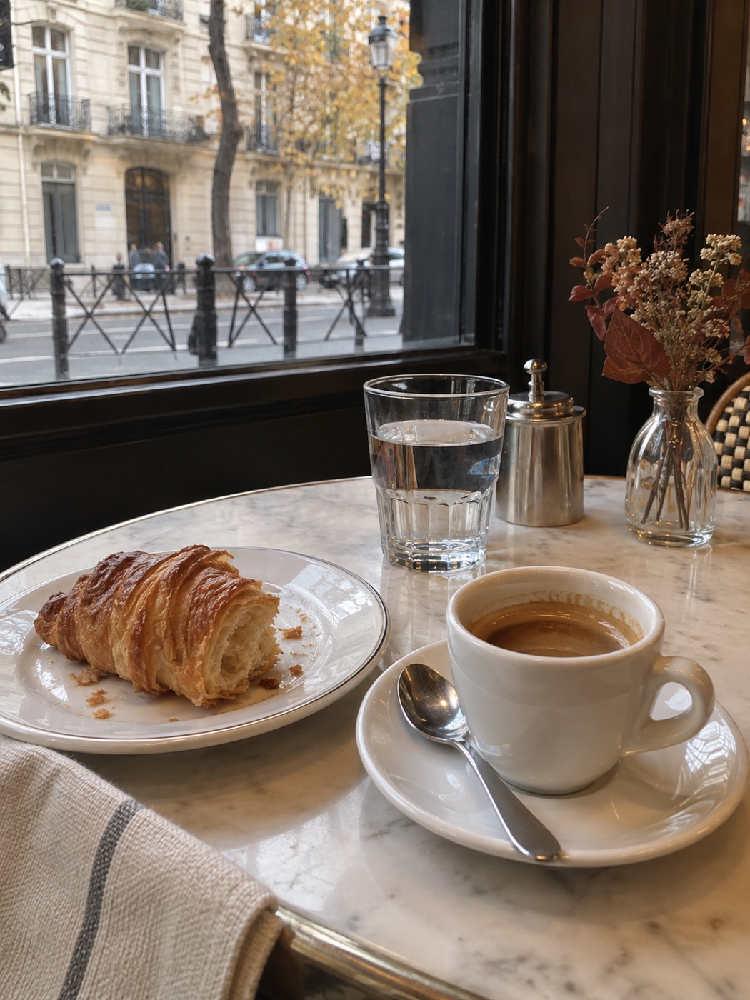

# 沙发旅行社 · Sofa Travel

**人没出门，相册先环游世界。**

一张自己的照片，或者连脸都不露。让你的 Agent 带你去巴黎发呆、去冰岛吹风、在京都听一场雨。

免费、开源、中文。给 Codex、Claude Code、WorkBuddy 等能读文件的 Agent 使用。没有生图工具也能玩：拿到完整中文提示词，复制到豆包、即梦等官方工具即可继续。


[下载 Skill ZIP](https://github.com/HeiGeAi/sofa-travel/releases/download/v1.0.0/sofa-travel-1.0.0.zip) · [阅读 Agent 入口](START.md) · [验证记录](docs/VERIFICATION.md)

图为本项目实际生成的样片，人物完全虚构。软件与提示词免费，第三方生图费用或免费额度按所用工具规则。

## 把这段话交给你的 Agent

直接复制下面整段，或把下载的项目文件夹交给它：

```text
请读取 https://github.com/HeiGeAi/sofa-travel 的 START.md 和 SKILL.md，带我玩一次。

我假期不出门，想假装去全世界旅行。目的地你帮我选，先做三张有旅行过程的照片，像朋友用手机随手拍的。

有照片和可用生图能力时，帮我真实出图；没有时，直接给我能复制到豆包或即梦的完整中文提示词。不要只给计划，不要让我配置一堆东西。
```

也可以直接说：

* 「带我去冰岛。我想穿自己的绿色外套，拍六张。」
* 「我不想露脸，在京都听雨，三张中文提示词。」
* 「我和朋友去罗马，别拍成婚纱照。」
* 「带我家橘猫去大理，别让猫吃人的东西。」
* 「不像我，保留背景，只修人物。」

## 你会得到什么

| 交付 | 有什么 |
| :--- | :--- |
| 中文旅行包 | 独立可复制的提示词、参考照片说明、修图指令、分享文案 |
| 成套镜头 | 到了、走走、歇一会儿，再延展成六张或九张 |
| 本地相册 | 有文件工具时生成，可双击打开，图片导入后离线分享 |
| 真实照片 | 当前工具支持生图并完成调用时才有，不用素材图假装成功 |
| 玩法手帐 | [打开本地版](site/index.html)，目的地抽签、风格切换、中文提示词与下载 |

GitHub 不直接执行 HTML。先下载仓库 ZIP，解压后双击 `site/index.html`。无需启动服务器，无需联网，不接收用户照片。

## 看一趟真实样例

| 到了 | 走走 | 歇一会儿 |
| :--- | :--- | :--- |
|  |  |  |

[完整中文提示词](examples/paris-weekend/旅行包.md) · [原始虚构人物参考](assets/reference.jpg) · [验证范围](docs/VERIFICATION.md)

样片通过原生生图工具生成；不同平台的身份保持、画幅、速度与费用会不同。不宣称所有平台效果相同。

## 三种入口

**零安装。** Agent 读取仓库中的 START.md 与 SKILL.md，按需读取参考文件。只有网页读取能力时也可按文件逐个读；不能联网就提供 ZIP。仅能聊天时，使用本地玩法手帐里的完整中文提示词。

**导入 Skill。** 运行 `python3 scripts/package.py` 得到 `dist/sofa-travel-1.0.0.zip`，或下载发布提供的同名 ZIP。包内根目录即 SKILL.md。WorkBuddy 使用当前版本的本地技能包导入入口，详见 [兼容指南](docs/COMPATIBILITY.md)。

**命令行。** Python 3.10+，不需要 pip 安装依赖：

```bash
python3 scripts/travel.py list
python3 scripts/travel.py plan --destination 冰岛 --count 6 --platform doubao --output output/iceland
```

输出旅行包、独立提示词和相册。`--mode faceless` 不露脸，`--mode duo` 双人，`--mode pet` 宠物独照，`--mode pet_pair` 人与宠物同框；`--style film` 电影感，`--style playful` 幽默；`--destination surprise --seed 42` 可复现抽签。

生成工具返回照片后可导入：

```bash
python3 scripts/travel.py attach --trip output/iceland --shot 01 --image /path/to/photo.png
```

输出目录里的私人照片不应提交 Git。默认 output 已被忽略；打包器仅收录明确列出的公共文件。

## 已有 heige-image？

直接复用你的安装和配置。适配器默认只检查计划，用户明确要生图时加 `--execute`，不会替你改配置或复制密钥。

```bash
python3 scripts/generate.py --trip output/iceland --skill-dir /path/to/heige-image --reference /path/to/me.jpg
```

[平台适配说明](references/providers.md)。原生工具也可以直接使用中文提示词，heige-image 不是必装依赖。

## 首批目的地

巴黎、冰岛、京都、大理、重庆、上海、伊犁、罗马、巴厘岛、瑞士山间、伊斯坦布尔、开普敦。内置场景提供稳定起点；其他地方直接告诉 Agent，它可按导演手册编排。

这些是虚拟旅行创作设定，不是实时旅游攻略或天气预报。照片自然，分享坦率：人在家里，想象在远方。

## 开发与验证

```bash
python3 -m unittest discover -s tests -v
python3 scripts/build_site.py
python3 scripts/package.py
```

核心使用 Python 标准库，玩法手帐用原生 HTML、CSS、JavaScript。网站提示词由同一个 Python 核心预编译，避免两套生成规则漂移。前端资源已内嵌，断网可用。

当前质量证据与尚未覆盖的测试见 [验证记录](docs/VERIFICATION.md)。贡献新目的地时，同时提交具体镜头、中文提示词和标明生成工具的自有样片，见 [贡献说明](CONTRIBUTING.md)。

代码与原创提示词使用 MIT 许可证。样片为本项目 AI 生成的虚构人物创作。第三方设计来源见 [来源说明](THIRD_PARTY_NOTICES.md)。
