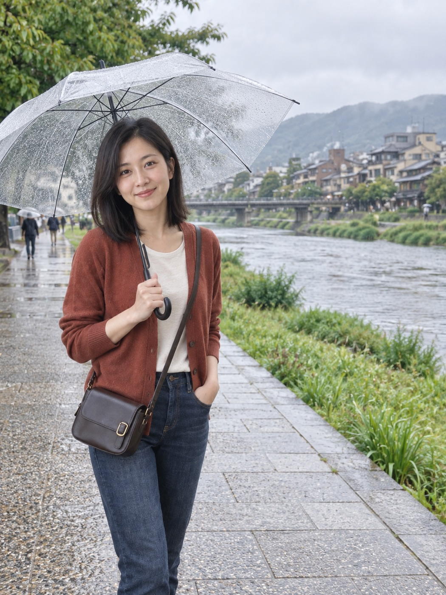
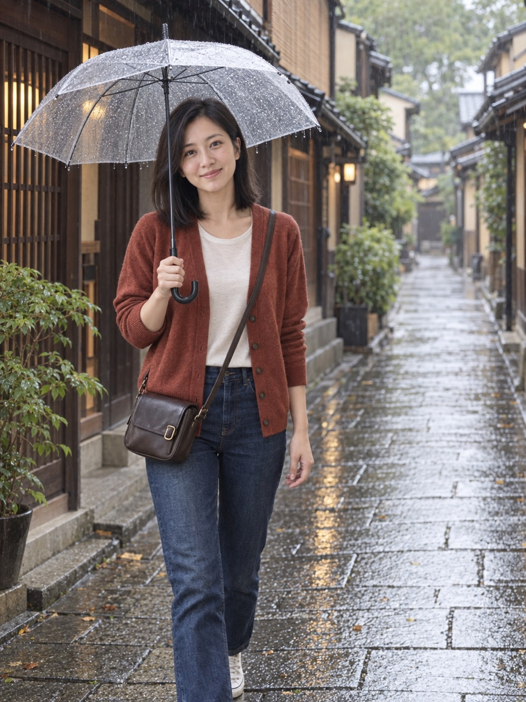
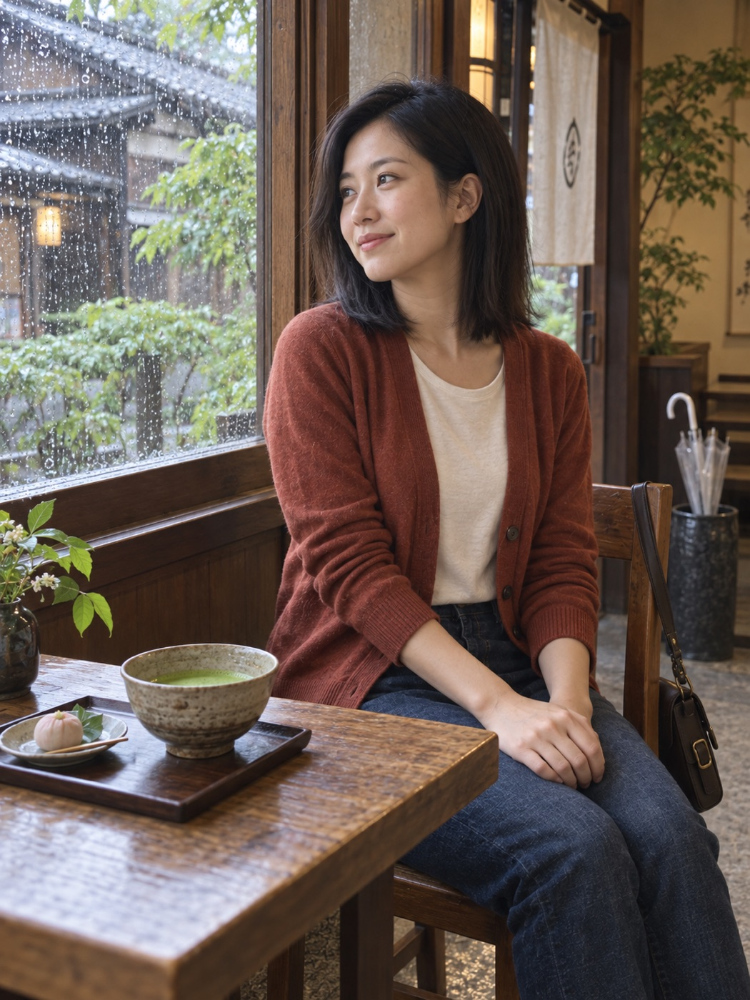

# 沙发旅行社｜在京都，把半天借给雨

人没出门，相册先环游世界。

目的地：京都。模式：本人出镜。风格：朋友随手拍。

当前交付：已导入 3/3 张实际图片，图片质量仍需目视检查。软件与提示词免费，生图费用或免费额度取决于所用工具。

## 怎么拍

上传一张清晰、无遮挡的本人照片。先检查当前工具是否支持参考图编辑。支持时用原始参考图生成第一张，再继续同组镜头；不支持时保留提示词交付，不冒充已生成。每次生成保留原始身份参考，不只依赖上一张成片。

先生成第一张，检查人物相似度和光线，再继续。人物镜头始终带上原始参考图；风景和餐桌镜头无需人脸图。若使用成片辅助构图，明确原始图只管身份、成片只管穿搭与风格。

## 01｜鸭川边，先听一会儿雨

参考图：需要。使用原始人物或宠物参考图。

```text
请生成一张京都虚拟旅行相册中的独立写实照片。这是国庆假期的 AI 创意照片，不是实地拍摄记录。只生成这一张，不做拼贴或九宫格。

以原始参考照片中的成年女性为同一个人。保留她的脸型、五官比例、肤色、齐肩黑色偏侧分直发、年龄感和体型，保留自然皮肤纹理，不改变成陌生人或网红脸。她穿砖红色轻薄开衫、米白色圆领内搭、深色牛仔长裤，挎深棕色小号斜挎包。

场景与动作：京都鸭川宽阔平整的公共步道，河面、绿色河岸与远处低矮建筑自然分布。她远离水边，撑一把透明雨伞，侧身停步看向镜头，人物位于左侧三分之一，右侧留出河面。

季节与天气：初秋细雨，植物以绿色为主，不添加樱花、雪景或满山红叶。拍摄：环境人像中远景，平视，拍到膝盖以上，伞面不遮挡五官。柔和阴天自然光或窗边光，真实手机抓拍，克制的暖木色与绿色，保留环境细节、自然肤质和衣物纹理。

人物与环境的透视、尺度、光线和接触阴影一致。肢体及雨伞结构自然，不复杂摆拍，不磨皮，不夸张虚化。不添加标题、签名和装饰文字。三比四竖幅构图。
```



## 02｜雨巷里，不赶下一站

参考图：需要。使用原始人物或宠物参考图。

```text
重新创作一张独立的写实旅行照片，三比四竖幅。只用所附参考照片保持人物身份与穿搭。这是虚构成年女性的 AI 京都假期相册样片。

保留参考人物的脸型、五官比例、自然肤色、齐肩黑色偏侧分头发，砖红色轻薄开衫、米白圆领上衣、深蓝牛仔裤及深棕色小斜挎包。不要磨皮、不要改变为网红脸。

在京都普通町屋雨巷，木格栅门面、低屋檐、湿润石板路、初秋绿色植物，细雨与柔和阴天光。透明雨伞上有细小雨滴。没有樱花、雪、浓烈红叶、可读商标或其他城市地标。

最重要是自然人体姿态：摄影者是走在她前方的朋友，位于她正前方稍偏侧面。她缓慢朝摄影者走来，胸口正面和开衫两侧清晰可见。头、肩、胸、骨盆保持同一行进方向，脖子自然直立，绝不背对镜头再扭头，不耸肩。她视线轻轻看向前方的朋友，神情轻松，嘴角微微上扬，不摆拍。两肩放松，右手在上腹部高度轻松握住雨伞手柄，肘部自然下垂靠近身体，伞杆在身体右侧与脸部保持距离，伞面在头顶留出合理空间，结构连接真实；左臂自然随步伐垂落，手指放松。小步行走、重心稳定、衣服自然垂坠。所有手臂、手指、伞杆结构符合人体和物理逻辑。

相机距离稍远，平视拍摄，从头顶伞面到小腿的环境人像，人物位于画面偏左，右侧和后方有足够街巷景深，环境占画面约一半。真实朋友用手机随手拍到的瞬间，适度景深，场景可辨认，克制暖木色和灰绿色，自然皮肤细节。人和环境光线、尺度、透视及接触阴影统一。不要拼贴、文字、签名或水印。
```



## 03｜茶杯前，把下午放慢

参考图：需要。使用原始人物或宠物参考图。

```text
请生成一张京都虚拟旅行相册中的独立写实照片。这是国庆假期的 AI 创意照片，不是实地拍摄记录。只生成这一张，不做拼贴或九宫格。

以原始参考照片中的成年女性为同一个人。保留她的脸型、五官比例、肤色、齐肩黑色偏侧分直发、年龄感和体型，保留自然皮肤纹理，不改变成陌生人或网红脸。她穿砖红色轻薄开衫、米白色圆领内搭、深色牛仔长裤，挎深棕色小号斜挎包。

场景与动作：京都普通小茶馆的窗边木桌，桌上放着一碗抹茶与一小碟朴素点心。她侧坐在木椅上，双手自然放在腿上，脸朝向窗外的雨，露出清楚的三分之二侧脸，表情放松。收好的透明雨伞在远处门边伞桶，包自然挂在她的椅背。窗外是带雨滴的玻璃、绿色树叶和木屋檐。

季节与天气：初秋细雨，植物以绿色为主，不添加樱花、雪景或满山红叶。拍摄：坐姿环境人像中景，从桌角斜侧面拍摄，茶碗在前景，人物脸部仍清楚，室内曝光自然。柔和阴天自然光或窗边光，真实手机抓拍，克制的暖木色与绿色，保留环境细节、自然肤质和衣物纹理。

人物与环境的透视、尺度、光线和接触阴影一致。肢体及雨伞结构自然，不复杂摆拍，不磨皮，不夸张虚化。不添加标题、签名和装饰文字。三比四竖幅构图。
```



## 发相册时可以这样写

国庆没有赶路，把半天借给京都的雨。
实际行程：卧室、客厅、冰箱。
本相册由 AI 创作，人在家里，想象在京都。

## 出图不满意

修改已有成片时，保留原图并另存新版本。身份修复同时提供原始身份图和待修成片，明确两张图各自用途。

### 不像本人

以原始人物参考照片为身份依据，修正当前照片中人物的脸型、五官相对位置、眼镜、发型与年龄感。不要变成相似的陌生人。保留当前照片的场景、构图、动作、衣服与光线，仅修正人物身份。不要通过增强磨皮来处理相似度。

### 像贴上去的

保留人物身份、衣服、动作和背景布局，只修正人物与场景的融合：统一光源方向与色温，匹配镜头透视、人物尺度、边缘清晰度和景深，补全脚底或座椅接触阴影。不要更换人物或目的地。

### 太像广告

保留同一人物、地点和动作，把当前照片调整为普通朋友用手机拍下的旅行记录。减少磨皮、夸张轮廓光和背景虚化，恢复自然肤质、环境细节和轻微生活感。不要添加脏污或无意义噪点。

### 手或动作奇怪

保持人物身份、服装、场景和光线，修正不自然的手部与肢体关系。必要时把动作简化为自然垂手或轻扶包带，保持手指数目与关节合理，不重画整张脸，不更换背景。

### 地点不对

保持人物身份和镜头构图，依据所提供的真实地点参考图修正背景建筑或地貌。不要把不同城市地标混在同一场景，不猜测参考图中看不到的结构。若没有地点参考，先索取或寻找可核对的参考，再修正。
