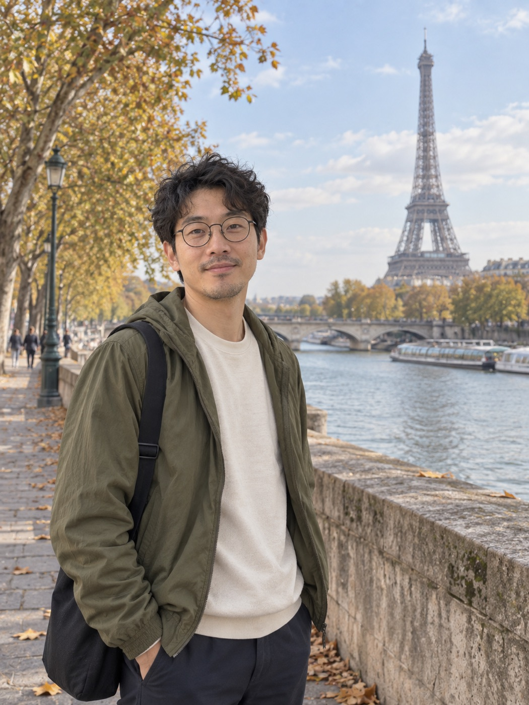
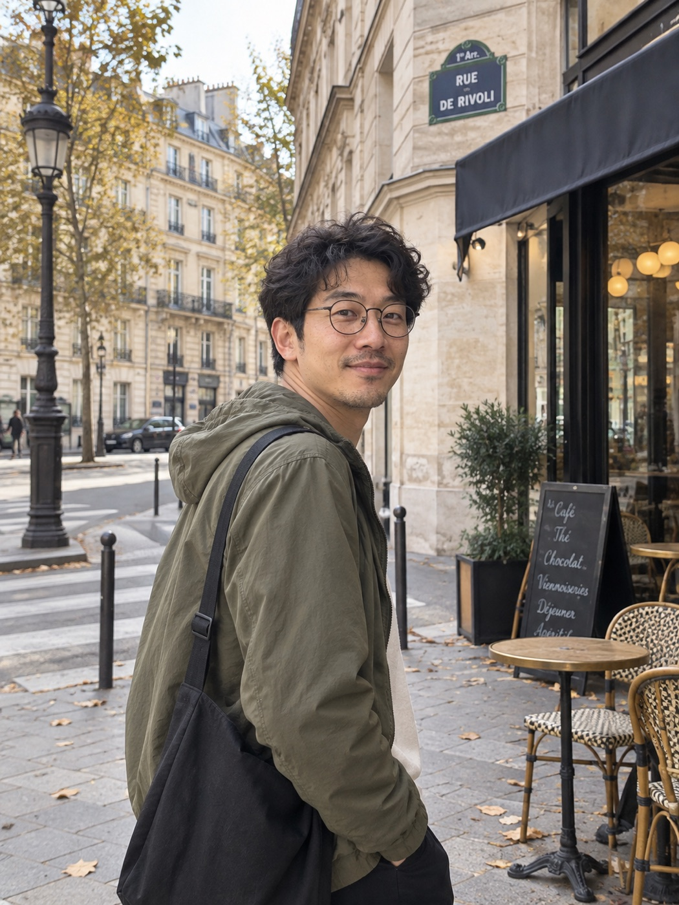

# 沙发旅行社｜在巴黎，把一天过慢一点

人没出门，相册先环游世界。

目的地：巴黎。模式：本人出镜。风格：朋友随手拍。

当前交付：已导入 3/3 张实际图片，图片质量仍需目视检查。软件与提示词免费，生图费用或免费额度取决于所用工具。

## 怎么拍

上传一张清晰、无遮挡的本人照片。先检查当前工具是否支持参考图编辑。支持时用原始参考图生成第一张，再继续同组镜头；不支持时保留提示词交付，不冒充已生成。每次生成保留原始身份参考，不只依赖上一张成片。

先生成第一张，检查人物相似度和光线，再继续。人物镜头始终带上原始参考图；风景和餐桌镜头无需人脸图。若使用成片辅助构图，明确原始图只管身份、成片只管穿搭与风格。

## 01｜到了

参考图：需要。使用原始人物或宠物参考图。

```text
请生成一张巴黎虚拟旅行相册中的独立照片。这是假期的创意照片，不是实地拍摄记录。只生成这一张，不做九宫格或拼贴。

以我上传的原始参考照片为同一个人，保留脸型、五官比例、肤色、发型、眼镜等可见特征、年龄感和体型，不替换成网红脸，不改变性别呈现。人物统一穿着苔绿色轻薄外套、米白色圆领上衣、深色长裤、深色帆布挎包。

场景：塞纳河步道，远处只有一座埃菲尔铁塔。季节与天气设定：秋日微凉，薄外套。画面内容：人物占画面约三分之一，自然侧身看向镜头，双手轻松垂下。

拍摄：中景或环境人像，地标留在远处，人物与景物尺度自然。光线：柔和日间自然光。普通手机后置摄像头拍摄的旅行抓拍感，构图略有留白，肤质自然，清晰但不过度锐化，不使用影楼打光或过度虚化。

保持合理的建筑结构、人物透视、重力与接触阴影；不要重复地标，不把不同城市景物拼在一起，避免不自然的手部与肢体。不额外添加标题、签名或装饰文字。三比四竖幅构图，若工具不支持则使用最接近的竖幅。
```



## 02｜走走

参考图：需要。使用原始人物或宠物参考图。

```text
请生成一张巴黎虚拟旅行相册中的独立照片。这是假期的创意照片，不是实地拍摄记录。只生成这一张，不做九宫格或拼贴。

以我上传的原始参考照片为同一个人，保留脸型、五官比例、肤色、发型、眼镜等可见特征、年龄感和体型，不替换成网红脸，不改变性别呈现。人物统一穿着苔绿色轻薄外套、米白色圆领上衣、深色长裤、深色帆布挎包。

场景：普通巴黎街角的浅色石材建筑和路边咖啡桌。季节与天气设定：秋日微凉，薄外套。画面内容：人物自然走过，回头看向同行朋友的镜头。

拍摄：平视街头抓拍，环境占一半以上画面，避免路人抢占主体。光线：与第一张一致的日间天气。普通手机后置摄像头拍摄的旅行抓拍感，构图略有留白，肤质自然，清晰但不过度锐化，不使用影楼打光或过度虚化。

保持合理的建筑结构、人物透视、重力与接触阴影；不要重复地标，不把不同城市景物拼在一起，避免不自然的手部与肢体。不额外添加标题、签名或装饰文字。三比四竖幅构图，若工具不支持则使用最接近的竖幅。
```



## 03｜歇一会儿

参考图：不需要。

```text
请生成一张巴黎虚拟旅行相册中的独立照片。这是假期的创意照片，不是实地拍摄记录。只生成这一张，不做九宫格或拼贴。

这一张是同一趟旅行中的无人物插页，不出现旅行者，不需要人物参考照片。

场景：街边咖啡馆的一杯浓缩咖啡与一小块可颂。季节与天气设定：秋日微凉，薄外套。画面内容：只拍桌上的食物与餐具，不出现人脸和手部，不出现商标，不宣称特定店铺。

拍摄：坐在桌边的第一视角近景，不拼贴地标。光线：窗边柔和日光。普通手机后置摄像头拍摄的旅行抓拍感，构图略有留白，肤质自然，清晰但不过度锐化，不使用影楼打光或过度虚化。

保持合理的建筑结构、人物透视、重力与接触阴影；不要重复地标，不把不同城市景物拼在一起，避免不自然的手部与肢体。不额外添加标题、签名或装饰文字。三比四竖幅构图，若工具不支持则使用最接近的竖幅。
```


## 发相册时可以这样写

把赶路取消，把发呆排满。
实际行程：卧室、客厅、冰箱。
本相册由 AI 创作，人在家里，想象在巴黎。

## 出图不满意

修改已有成片时，保留原图并另存新版本。身份修复同时提供原始身份图和待修成片，明确两张图各自用途。

### 不像本人

以原始人物参考照片为身份依据，修正当前照片中人物的脸型、五官相对位置、眼镜、发型与年龄感。不要变成相似的陌生人。保留当前照片的场景、构图、动作、衣服与光线，仅修正人物身份。不要通过增强磨皮来处理相似度。

### 像贴上去的

保留人物身份、衣服、动作和背景布局，只修正人物与场景的融合：统一光源方向与色温，匹配镜头透视、人物尺度、边缘清晰度和景深，补全脚底或座椅接触阴影。不要更换人物或目的地。

### 太像广告

保留同一人物、地点和动作，把当前照片调整为普通朋友用手机拍下的旅行记录。减少磨皮、夸张轮廓光和背景虚化，恢复自然肤质、环境细节和轻微生活感。不要添加脏污或无意义噪点。

### 手或动作奇怪

保持人物身份、服装、场景和光线，修正不自然的手部与肢体关系。必要时把动作简化为自然垂手或轻扶包带，保持手指数目与关节合理，不重画整张脸，不更换背景。

### 地点不对

保持人物身份和镜头构图，依据所提供的真实地点参考图修正背景建筑或地貌。不要把不同城市地标混在同一场景，不猜测参考图中看不到的结构。若没有地点参考，先索取或寻找可核对的参考，再修正。
